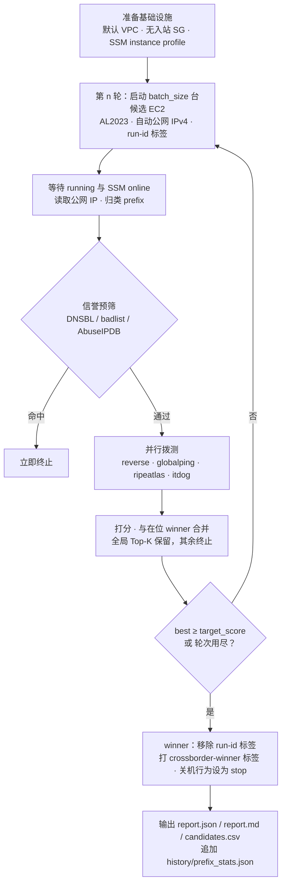

# aws-crossborder-instance-selector

在 AWS 上批量启动候选 EC2，从中国大陆视角拨测其公网 IPv4，保留跨境质量最优的实例。


> AWS 没有"跨境优选 IP"服务。EC2 自动分配的公网 IPv4 无法转成 EIP，EIP 分配器会反复返回同一地址，且每 Region 仅 5 个配额。本工具改为筛选实例本身：多轮启动临时 EC2，拨测其公网 IP，保留胜出实例、终止其余。胜出实例持续运行期间 IP 保持不变（reboot 保留 IP，stop/start 会更换）。

## 目录

- [快速开始](#快速开始)
- [工作原理](#工作原理)
- [拨测数据源](#拨测数据源)
- [打分规则](#打分规则)
- [配置](#配置)
- [前置条件](#前置条件)
- [成本](#成本)
- [Winner 注意事项](#winner-注意事项)
- [安全边界](#安全边界)
- [测试](#测试)
- [Claude Code skill 与报告查看页](#claude-code-skill-与报告查看页)
- [项目结构](#项目结构)
- [局限与非目标](#局限与非目标)
- [文档](#文档)

## 快速开始

```bash
git clone <this-repo> && cd aws-crossborder-instance-selector
python3 -m venv .venv && . .venv/bin/activate && pip install -r requirements.txt
pytest -q                                                   # 101 passed，不访问网络、不需凭证

scripts/find_best_instance.sh ap-east-1 2 1 1 --dry-run     # 只打印计划，不创建资源
scripts/find_best_instance.sh ap-east-1 2 1 1               # 冒烟：2 台、1 轮，约 5～8 分钟
scripts/find_best_instance.sh ap-east-1 20 3 1 --protect    # 正式：每轮 20 台、最多 3 轮、保留 1 台
```

位置参数依次为 Region、每轮候选数、最大轮次、保留数；其后可追加任意 CLI 参数，例如 `--protect`、`--enable-backend itdog`。

命令输出的第一行是 `run-id: xb-...`。清理和重生成报告都依赖它：

```bash
python -m crossborder_selector.cli cleanup --region ap-east-1 --run-id <run-id>
python -m crossborder_selector.cli report  --run-id <run-id> --output-dir ./out
```

## 工作原理



每轮候选机的存活时间约 5～8 分钟。所有候选机都带 `crossborder-run-id=<run-id>` 标签，任何异常路径都会终止非 winner 实例，遗漏的可用 `cleanup --run-id` 收尾。

## 拨测数据源

| backend | 视角 | 默认 | 需要 key | 局限 |
|---|---|:---:|:---:|---|
| `reverse` | 候选机经 SSM 向大陆三网目标 ping + tcping（出境路径近似） | 开 | 否 | 探测对象是运营商机房而非家宽；ICMP 可能被限速 |
| `globalping` | HK/TW 公共探针 → 候选 IP | 开 | 否 | 无中国大陆探针，只反映港台质量；匿名额度约 250 tests/h，配置 `api_token` 后约 500 tests/h |
| `ripeatlas` | RIPE Atlas 大陆在线探针 → 候选 IP | 关 | 是 | 大陆在线探针数量少；one-off 结果通常需要数分钟 |
| `itdog` | itdog.cn 三网家宽节点 → 候选 IP（仅 ping） | 关 | 否 | 非官方接口，可能随时失效；失败只降级不阻塞 |

`reverse.targets` 每项可写 `host` 或 `host:port`。ping 只用 host 部分；tcping 用条目端口，未给端口则回退到 `tcping_port`。默认目标里的纯 IP 是运营商公共 DNS，走 53 端口；域名走 `tcping_port`（443）。

## 打分规则

1. **硬否决**（任一成立即淘汰）：信誉命中；`reverse` 三网全部丢包；有效 backend 数少于 `min_backends`；未分配公网 IP。
2. **子分**：每个探针样本 `100 × (1 − 丢包率) × 延迟因子`。延迟因子在 `lat_good_ms`（满分）与 `lat_bad_ms`（零分）之间线性递减。
3. **合成**：同一 backend 内先按 `weights.isps` 合并三网分；composite 再按 `weights.backends` 加权，只对返回有效数据的 backend 归一化权重，缺失 backend 不计零分。
4. **排序**：`(qualified, composite, reverse 分)` 降序。prefix 只记录，不参与打分。

## 配置

复制 `config.example.yaml` 为 `config.yaml` 后修改。包装脚本会在文件存在时自动传入 `--config`；直接调用 `python -m crossborder_selector.cli` 时，未指定 `--config` 且当前目录存在 `config.yaml` 也会自动读取并打印 `using config.yaml`。

| 键 | 默认值 | 说明 |
|---|---|---|
| `region` / `instance_type` | `ap-east-1` / `t3.nano` | 目标 Region 与候选机机型 |
| `batch_size` / `max_rounds` / `keep_top_k` | `10` / `3` / `1` | 每轮候选数、最大轮次、保留数 |
| `target_score` | `90` | 达到即提前停止 |
| `min_backends` | `1` | 有效 backend 少于此值即不合格 |
| `protect` | `false` | 对 winner 开启 `DisableApiStop` 与 `DisableApiTermination` |
| `backends.*.enabled` | reverse/globalping 开，ripeatlas/itdog 关 | 也可用 `--enable-backend` / `--disable-backend` 覆盖 |
| `weights.backends` | reverse .5 · globalping .2 · ripeatlas .15 · itdog .15 | backend 权重 |
| `weights.isps` | telecom .34 · unicom .33 · mobile .33 | 三网权重 |
| `weights.lat_good_ms` / `lat_bad_ms` | `60` / `300` | 延迟因子端点 |
| `subnet_id` / `security_group_id` / `instance_profile_name` | 空 | 空则使用默认 VPC 并自动创建、复用固定名称资源 |

密钥字段（`ripeatlas.api_key`、`globalping.api_token`、`reputation.abuseipdb_api_key`）不会写入报告。

## 前置条件

- 目标 Region 存在默认 VPC；没有时在 `config.yaml` 指定 `subnet_id` 与 `security_group_id`。
- 该 Region vCPU 配额不少于 `batch_size × 2`。
- AWS 凭证具备下列权限。

<details>
<summary>IAM action 清单</summary>

日常运行：`ec2:RunInstances`、`ec2:Describe*`、`ec2:TerminateInstances`、`ec2:CreateTags`、`ec2:DeleteTags`、`ec2:CreateSecurityGroup`、`ec2:ModifyInstanceAttribute`、`iam:CreateRole`、`iam:AttachRolePolicy`、`iam:CreateInstanceProfile`、`iam:AddRoleToInstanceProfile`、`iam:TagRole`、`iam:TagInstanceProfile`、`iam:PassRole`、`iam:Get*`、`ssm:SendCommand`、`ssm:GetCommandInvocation`、`ssm:DescribeInstanceInformation`、`ssm:GetParameters`。

仅 `cleanup --include-infra` 需要：`ec2:DeleteSecurityGroup`、`iam:RemoveRoleFromInstanceProfile`、`iam:DeleteInstanceProfile`、`iam:DetachRolePolicy`、`iam:DeleteRole`。

</details>

## 成本

香港 `t3.nano` 加公网 IPv4 每台每小时约 0.012 美元。每轮候选机存活 5～8 分钟，20 台 × 3 轮总成本低于 0.5 美元。胜出实例长期运行按机型计费，公网 IPv4 每小时 0.005 美元。

## Winner 注意事项

- **不要 stop 该实例。** stop/start 会更换公网 IP，reboot 不会。
- winner 的 `InstanceInitiatedShutdownBehavior` 已改为 `stop`，在 OS 内执行 `shutdown` 只会停机，不会终止实例。
- 标签：`crossborder-winner=true`、`crossborder-score`、`crossborder-round`、`crossborder-selected-at`。胜出时 `crossborder-run-id` 标签被移除，因此 `cleanup --run-id` 不会影响它。
- `--protect` 开启的保护可手动解除：

  ```bash
  aws ec2 modify-instance-attribute --instance-id <id> --no-disable-api-termination
  aws ec2 modify-instance-attribute --instance-id <id> --no-disable-api-stop
  ```

## 安全边界

- 安全组 `crossborder-selector-sg` 没有任何入站规则；候选机不开放端口、不配置 SSH。
- 不向候选机注入 AWS 凭证。探测脚本经 SSM 下发，只执行 ping 和 tcping。
- 所有候选机按 `crossborder-run-id` 隔离，`cleanup --run-id` 只影响本次 run。`cleanup --include-infra` 在存在 winner 时会拒绝删除共享资源。

## 测试

```bash
. .venv/bin/activate && pytest -q      # 101 passed
```

单元测试不访问网络：AWS 用 moto，SSM 与四个探测 backend 用注入的假 transport。dry-run 验证、真实冒烟、清理与中断恢复的完整步骤见 [TESTING.md](TESTING.md)。

## Claude Code skill 与报告查看页

| 文件 | 用途 |
|---|---|
| `.claude/skills/crossborder-select/SKILL.md` | Claude Code 项目级 skill。在本仓库目录打开 Claude Code 后，对它说"帮我找一台跨境质量好的 EC2"即可触发：它会执行 dry-run、select、读取报告并说明结果，中断时执行 cleanup。复制到 `~/.claude/skills/` 可全局使用。 |
| `ui/report-viewer.html` | 单文件报告查看页，浏览器直接打开。载入 `out/<run-id>/report.json` 或 `candidates.csv`，显示 winner、每轮结果、全部候选与 prefix 统计，并提供运行命令构造器。文件只在本地解析，不上传数据。 |

## 项目结构

```
crossborder_selector/
├── cli.py            select / cleanup / report 子命令
├── config.py         默认值、深合并、校验
├── orchestrator.py   多轮锦标赛：启动 → 预筛 → 拨测 → 保留 Top-K → 终止其余
├── scoring.py        子分、合成、硬否决、排序
├── report.py         JSON / Markdown / CSV 与 prefix 历史
├── aws/              ec2.py · infra.py · ssm.py · ipranges.py
├── probes/           base.py · reverse.py · globalping.py · ripeatlas.py · itdog.py
└── reputation/       dnsbl.py · badlist.py · abuseipdb.py
scripts/find_best_instance.sh   一条命令入口
ui/report-viewer.html           报告查看页
.claude/skills/crossborder-select/SKILL.md
tests/                          pytest，moto + 假 transport
docs/superpowers/               设计 spec 与实施计划
```

## 局限与非目标

- 不做 EIP 筛选，姊妹项目 `clean-ip-selection` 已覆盖。
- 不做长期监控与自动换机。
- 不做基于 prefix 历史的自动跳过，只记录统计。
- 不接入需要付费或国内云账号的拨测 API。

## 文档

| 文档 | 内容 |
|---|---|
| [MANUAL.md](MANUAL.md) | 按操作顺序的运维手册：安装、配置、dry-run、冒烟、正式运行、可选 backend、清理、故障排查、交付生产 |
| [TESTING.md](TESTING.md) | 单元测试、dry-run、真实冒烟、脚本语法检查、清理与中断恢复验证 |
| [docs/superpowers/specs/](docs/superpowers/specs/) | 设计 spec（架构、配置、打分、错误处理） |
